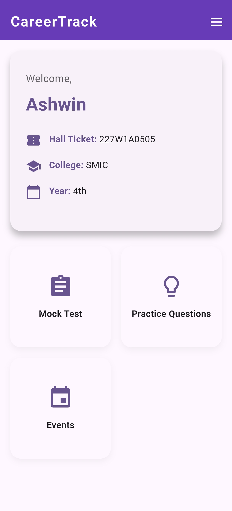
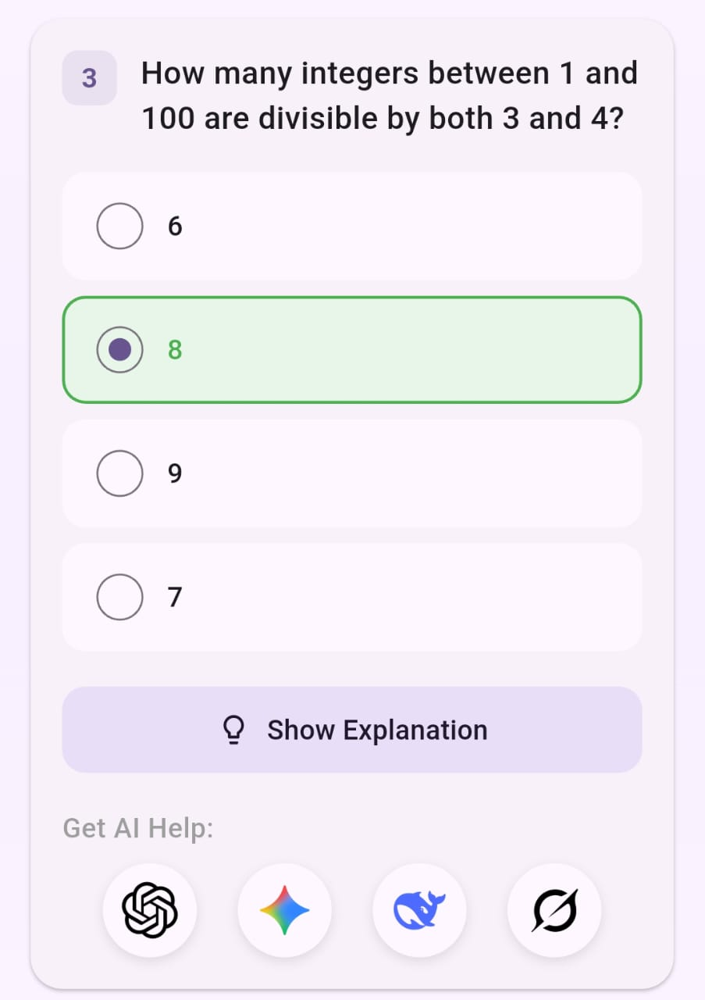
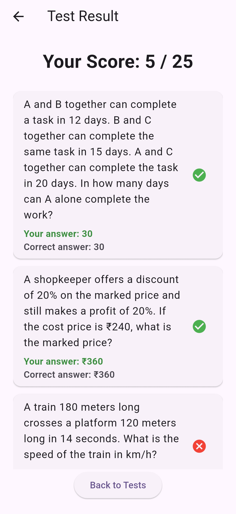
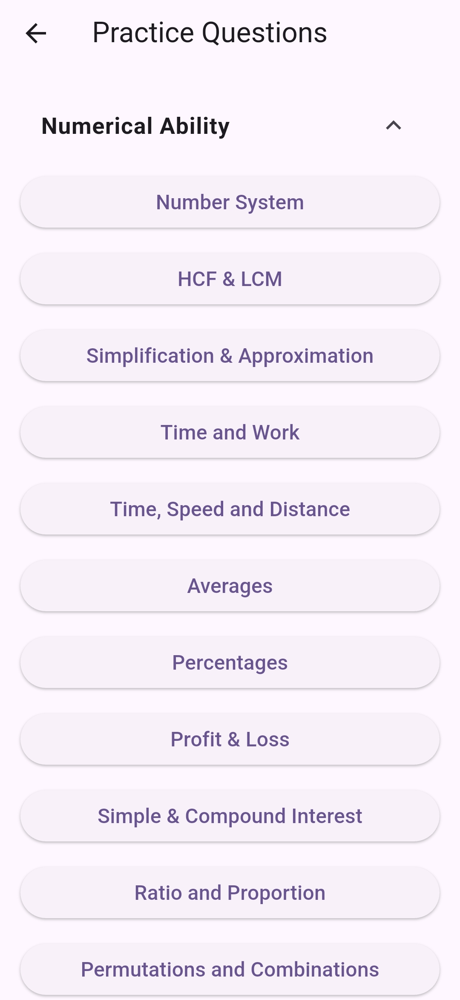

# CareerTrack 🧠📱

**CareerTrack** is an AI-powered aptitude preparation app built with Flutter. It helps students and job seekers practice for competitive exams like **TCS NQT**, **Wipro**, **Infosys**, and more. The app provides mock tests, topic-wise practice, and intelligent solutions using AI (optional).

---

## ✨ Features

- ✅ Topic-wise aptitude practice (e.g., Number System, Time & Work, Probability)
- ✅ AI-generated step-by-step solutions *(for internal use or future upgrade)*
- ✅ Mock tests with timer and scoring
- ✅ Database support for saving user scores and progress
- ✅ User-friendly Flutter UI

---


## 📁 Folder Structure

```
careertrack/
├── android/           # Android-specific code
├── assets/            # Fonts, images, question data
├── ios/               # iOS-specific code
├── lib/               # Flutter app source code
├── test/              # Test cases
├── web/               # Web support
├── pubspec.yaml       # Dependencies & assets
├── README.md          # This file
```

---

## ⚙️ Tech Stack

- **Flutter** – Cross-platform development (Android, iOS, Web)
- **Dart** – App logic, UI, state management
- **Custom JSON** – Offline storage of questions, topics, and mock tests
- **Firebase / SQLite** – To store:
  - User profiles
  - Mock test scores
  - Practice history
- **Bulk Upload Feature** – Add questions in bulk via JSON or admin interface 
- **AI Integration** – For generating explanations using LLMs

---

## 🚀 Getting Started

1. Clone the repo  
   ```bash
   git clone https://github.com/ashwin1099/career-track.git
   cd careertrack
   ```

2. Get dependencies  
   ```bash
   flutter pub get
   ```

3. Run the app  
   ```bash
   flutter run
   ```

---


## 📸 Screenshots

### 🏠 Home Screen  


### 🧪 Live Test  


### 📚 Practice Questions  


### 📊 Results Page  


### 🧠 Topic Selection  



---

## 📄 License

MIT License © 2025

---

Made with ❤️ using Flutter by Ashmin Saurav.
